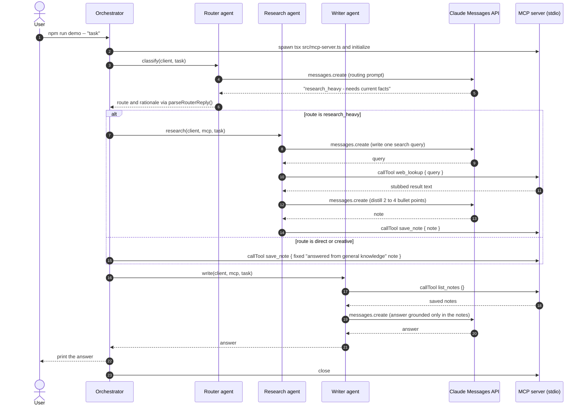

# multi-agent-mcp

A router, a research agent and a writer agent in TypeScript that share work only through tools on a custom Model Context Protocol (MCP) server.

By [Luis Monsalve](https://novaiflow.com). MIT licence.

## Why this exists

Multi-agent demos often connect agents with ad-hoc function calls, which makes every capability hard to reuse or govern.
Here every capability is a tool on one MCP server, and agents reach it only through `mcp.callTool(...)`.
The same server runs standalone over stdio, so any stdio MCP client can mount the tools the agents use.

## How one request flows

This is the `research_heavy` path as `src/orchestrator.ts` runs it. Every Claude call is a plain `messages.create`; there is no model-driven tool loop yet.



## Quickstart

Requires Node 20 or later.

```bash
git clone https://github.com/luissalve/multi-agent-mcp
cd multi-agent-mcp
npm install

npm test             # vitest run: offline, no API key needed
npm run typecheck    # tsc --noEmit

cp .env.example .env # then set ANTHROPIC_API_KEY in .env
npm run demo -- "Summarize the tradeoffs of RAG vs long context for support bots"
npm run mcp          # the MCP server on its own, over stdio
```

`npm run demo` needs ANTHROPIC_API_KEY. MODEL is optional and defaults to `claude-sonnet-5`. `.env.example` also lists MCP_TRANSPORT, which no code reads yet (see the roadmap).

## What to look at

- [`src/mcp-server.ts`](src/mcp-server.ts): the entire tool boundary, with three tools, zod-validated arguments and one note store per server instance.
- [`src/agents/research.ts`](src/agents/research.ts): the agent that crosses the MCP boundary. It runs a fixed single pass (plan, look up, distill, save), not a loop where Claude picks the tools.
- [`tests/mcp-server.test.ts`](tests/mcp-server.test.ts): drives the real server through an in-memory MCP transport, so argument validation is tested end to end without a network.

## Design decisions

- **Tools live only in the MCP server.** The research and writer agents call `mcp.callTool`, and the orchestrator adds one `save_note` call for non-research routes. No agent imports tool code.
- **The router's free text is mapped to a closed set of routes.** `parseRouterReply` in `src/lib/pure.ts` takes the first route keyword before the separator and defaults to `direct`, so a noisy reply cannot produce an invalid route.
- **Tool arguments are validated at the boundary.** The zod schemas in `src/lib/tool-schemas.ts` trim input, reject empty strings and cap length above what the agents can emit. The SDK rejects a bad call with an `isError` result before any handler runs, and clients see the bounds in `tools/list`.
- **SDK clients are passed in, not created inside agents.** `classify(client, task)` and `research(client, mcp, task)` take their clients as parameters, so tests use a fake Anthropic client and an in-memory MCP transport instead of paid API calls.
- **Control flow is linear and lives in one file.** The orchestrator only sequences the agents. The server writes its logs to stderr so they never corrupt the JSON-RPC stream on stdout.

## Status & roadmap

This is a v1 scaffold, not a hardened product. What runs today is the pipeline above, the stdio MCP server with validated arguments, and an offline test suite.

Known limitations:

- `web_lookup` returns a stubbed string. No search provider is wired in.
- Notes live in memory for the life of one server process.
- Agents read tool results as text and do not yet check the `isError` flag.
- `redactSecrets` exists in `src/lib/pure.ts` but nothing logs tool I/O through it yet.

Next commits, detailed in [CHANGELOG-PROPOSAL.md](CHANGELOG-PROPOSAL.md):

1. `test(router,mcp)`: route-selection tests and bounded tool argument validation. Done in this revision.
2. `fix(mcp)`: start the server when run directly on Windows. Done in this revision.
3. `fix(agents)`: fail loudly when an MCP tool call returns `isError`. Planned.
4. `feat(research)`: let Claude choose MCP tools in a bounded tool-use loop. Planned.
5. `feat(mcp)`: serve the same tools over Streamable HTTP when MCP_TRANSPORT is `http`. Planned. OAuth 2.1 for remote clients stays planned after that.

See [ARCHITECTURE.md](ARCHITECTURE.md) for the component map.

## Licence

MIT. See [LICENSE](LICENSE).
