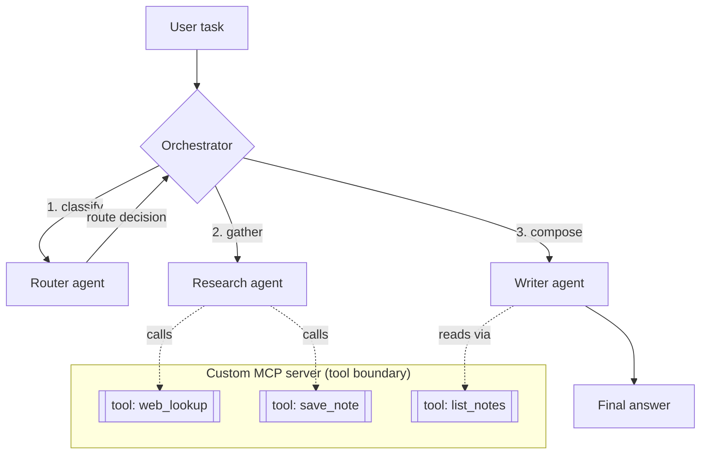

    

# multi-agent-mcp — a 3-agent team coordinated over a custom MCP server

> Built by [Luis Monsalve](https://novaiflow.com) · NovAIFlow — Applied AI Engineer (Multi-Agent · MCP · Voice AI)

A **router → research → writer** agent pipeline, where the agents don't call ad-hoc functions — they call **tools exposed by a custom [Model Context Protocol](https://modelcontextprotocol.io) server**. The same MCP server could be mounted in Claude Desktop or ChatGPT; here it's driven by a local orchestrator so you can see the whole loop in one process.

**Why this exists:** most "multi-agent" demos wire agents to each other with bespoke glue. That glue is exactly what MCP standardizes. This repo shows the pattern that survives production: agents are model-agnostic callers, capabilities live behind a versioned tool boundary (MCP), and the orchestrator only decides *who runs when*. Swap the transport from stdio to HTTP+OAuth and the same tools are consumable by any MCP client.

## How it works



- **Orchestrator** (`src/orchestrator.ts`) owns control flow only: it runs the router, then research, then writer. It holds no domain logic.
- **Router agent** classifies the task and returns a structured route (`research_heavy` | `direct` | `creative`) — a pure decision the orchestrator acts on.
- **Research agent** is allowed to call MCP tools (`web_lookup`, `save_note`) to gather grounded material.
- **Writer agent** reads the notes the researcher saved and composes the final answer.
- **The MCP server** (`src/mcp-server.ts`) is the one place tools are defined. Agents never import tool code directly — they call it across the MCP boundary, exactly as an external client (Claude, ChatGPT) would.

## Why MCP matters here (the differentiator)

MCP is the emerging standard for letting an LLM *act* — call tools, read resources — behind an authenticated, versioned boundary instead of hand-rolled function calls. Building agents **on top of a real MCP server** (rather than raw function dispatch) means:

- the same tools work from your orchestrator **and** from Claude Desktop / ChatGPT with zero rewrite;
- capabilities are versioned and permissioned at one boundary (add OAuth 2.1 for remote);
- you can reason about, log, and rate-limit every action in one place.

This is production-grade MCP work as a public reference — the pattern behind shipping remote MCP OAuth 2.1 connectors, shown here without any private/client code.

## Quickstart

```bash
git clone https://github.com/luissalve/multi-agent-mcp
cd multi-agent-mcp
cp .env.example .env      # add ANTHROPIC_API_KEY
npm install

# run the orchestrated 3-agent pipeline on a task
npm run demo -- "Summarize the tradeoffs of RAG vs long-context for support bots"

# or run the MCP server standalone (mount it in an MCP client)
npm run mcp
```

## Environment variables

| Variable | Required | Description |
|---|---|---|
| `ANTHROPIC_API_KEY` | yes | Claude API key used by all three agents |
| `MODEL` | no (default `claude-sonnet-5`) | Model id for the agents |
| `MCP_TRANSPORT` | no (default `stdio`) | `stdio` for local; `http` is the production/remote path (see ARCHITECTURE) |

Copy `.env.example` to `.env` and fill real values — never commit `.env`.

## Demo scope / roadmap — real vs. simplified

This is a **v1 scaffold** that proves the architecture, not a hardened product. Honestly:

**Real / wired to a real integration point:**
- A working MCP server (`@modelcontextprotocol/sdk`) exposing three tools (`web_lookup`, `save_note`, `list_notes`) over stdio.
- An orchestrator that runs router → research → writer using the Anthropic SDK's tool-use loop.
- A clean agent boundary: agents call tools through MCP, not direct imports.

**Out of scope for v1 (explicitly not attempted):**
- Real web search behind `web_lookup` — it returns a stubbed result with a clear TODO (swap in a search API).
- Remote transport + **OAuth 2.1** authentication (the production path; noted in ARCHITECTURE, not implemented here).
- Persistence beyond an in-memory note store, retries, cost accounting, and observability (see [`ai-engineering-cookbook`](https://github.com/luissalve/ai-engineering-cookbook)'s `observability` recipe).
- Parallel/graph agent execution — this is a linear pipeline on purpose.

A production version of this pattern — remote MCP with OAuth 2.1, many tools, operating against live business data — has been built for a client under NDA. Ask for a live walkthrough in an interview.

## Tests

```bash
npm test
```

One real unit test covers the pure route-selection helper in `src/lib/pure.ts`. Starting point, not a coverage claim.

## License

MIT — see [LICENSE](LICENSE).
